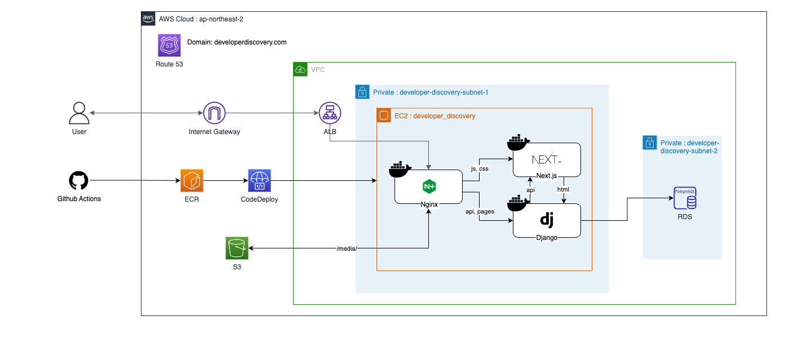
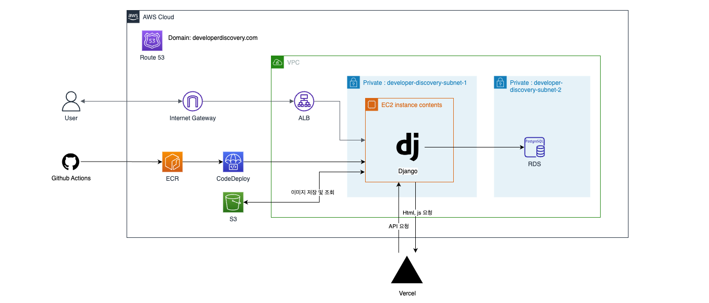

# Backend Developer Discovery

[](./reports/coverage/index.html)


## 프로젝트 소개
개발의 유용한 정보를 모아두는 사이트로 Discovery 에 영감을 받아 작업합니다. 현재 AWS 서버 비용 문제로 운영하지 않고 있습니다.

<br>

### 전체 구조



EC2 내부에 Nginx, Django, Next.js가 도커 컨테이너로 실행됩니다. Nginx를 통해 healthcheck 와 라우팅을 설정합니다. Next.js 에서 페이지를 리턴하고 필요한 API 는 Django에서 응답하게 됩니다.
기능적인 부분과 테스트, 문서화를 더 보충한 이후에 캐싱 및 최적화를 진행할 예정입니다. 관련 프론트와 인프라는 아래 연계 프로젝트에서 진행합니다.

<br>

<br>

<details>
<summary>기존 배포 구조(deprecated)</summary>

웹페이지는 SSR 방식으로 프론트 부분은 Vercel 서버에 배포하고, 이를 EC2에 올라가 있는 Django에서 렌더링 합니다. 회원 로직과 게시판이 주 기능으로 마크다운 에디터를 사용하고, 글에 추가되는 이미지는 S3에 업로드 합니다.



- 이슈 : 페이지 렌더링 시간이 오래걸림
  - 원인 : 기존 Vercel을 이용하게 되면, 각각 다른 네트워크에 있는 서버로 `EC2` <=> `Vercel` 사이에 통신이 많은 점
  - 해결 : Nginx를 통한 EC2 내부 컨테이너 간의 통신으로 변경 및 캐싱 적용

- 이슈 : Django DEBUG=False 옵션에서 static, media, Next.js 페이지와 각종 이미지 제공 안됨.
  - 해결 : Nginx 도입

</details>

<br>

### 연계 프로젝트

- 프론트 
  - [FrontendDeveloperDiscovery](https://github.com/rha6780/Frontend_Developer_Discovery)
  - Typescript, Next.js

- 인프라
  - [InfraDeveloperDiscovery](https://github.com/rha6780/Infra_Developer_Discovery) 
  - Terraform, AWS


<br>

## Architecture

### DB ERD


<br>

## 개발 환경

<details>
<summary>환경 구성</summary>

- Python 3.10
- 다음 명령어를 순차적으로 실행하여 환경 구성을 합니다.
- git clone 프로젝트_CLONE_URL
- `pipenv install`
- `pipenv shell` 로 가상환경에 들어갑니다.
- .envs 폴더를 생성하고 폴더 안에 .dev, .prod, .test 파일을 생성합니다.
- 해당 파일들에 아래 코드를 작성합니다.
```
SECRET_KEY='시크릿 키'
POSTGRES_DB=test_db
POSTGRES_USER=postgres
POSTGRES_PASSWORD=postgres
POSTGRES_HOST=127.0.0.1
POSTGRES_PORT=5432
```

</details>

<details>
<summary>coverage</summary>

- 로컬에서 환경 구성 이후 developer_discover 폴더에서 coverage run manage.py test 를 통해 현재 커버리지를 알 수 있습니다. 로컬 개발 시 수시로 확인해서 80% 를 목표로 테스트 코드를 작성합시다.
- [coverage](https://coverage.readthedocs.io/en/latest/index.html) 및 [badge](https://smarie.github.io/python-genbadge/) 관련 문서를 참고하세요.
- TODO: github action으로 coverage 뱃지 업데이트 자동화하기

**스크립트**

- scripts 폴더에서 sh coverage_update.sh

**수동 업데이트**
- 프로젝트 루트에서 `cd developer discover`
- 이전에 테스트한 결과가 있는 경우, `coverage erase`
- `coverage run manage.py test` 를 통해 테스트
- `coverage xml && coverage html` 로 각각 파일 생성
- `mv coverage.xml ../reports/coverage` html의 경우 htmlcov 에서 index를 coverage 폴더로 이동
- 프로젝트 루트에서 `genbadge coverage`로 뱃지 업데이트

</details>
